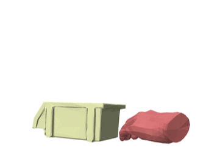
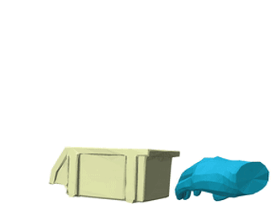
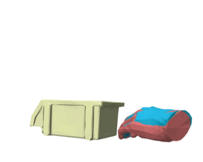

# Generalizable HOI Denoising


## [Project](https://meowuu7.github.io/GeneOH-Diffusion/) | [Gradio Demo](https://huggingface.co/spaces/xymeow7/gene-hoi-denoising) | [OpenReview](https://openreview.net/forum?id=FvK2noilxT)

The PyTorch implementation of the paper [**"GeneOH Diffusion"**](https://arxiv.org/abs/2209.14916).


## Getting started

This code was tested on `Ubuntu 20.04.5 LTS` and requires:

* Python 3.8.13
* conda3 or miniconda3
* CUDA capable GPU (one is enough)

### 1. Setup environment

Create a virtual environment

```shell
conda create -n geneoh-diffusion python==3.8.13
```

Install dependencies via `pip`

```shell
pip install -r requirements.txt --no-cache
```

Install `manopth`

```shell
cd manopth
pip install -e .
cd ..
```

**Note that the MANO layer we use is slightly different from the original official release. The `manopth` package should be install from this project otherwise the model would produce wierd denoised results**

### 2. Download pre-trained model

Download model from [here](https://drive.google.com/file/d/1Uv030DkxRE8VgjlMnXhwmAk27L9dNM18/view?usp=drive_link) and put it under the `./ckpt` folder. 

### 3. Get data 


We include data samples from a recent [TACO dataset](https://taco2024.github.io/) in the folder `./data/taco/source_data` for test. More data is coming. 


## Example Usage


### TACO example

Use the model to clean the noisy trajectory `data/taco/source_data/20231104_017.pkl`. Input, result, and the overlayed video are shown as below.


|        Input        |       Result         |         Overlayed         |
| :----------------------: | :---------------------: | :-----------------------: |
|  |  |  |


Follow steps below to reproduce the above result. 

1. **Denoising**
   ```bash
   bash scripts/val_examples/predict_taco_rndseed_spatial_20231104_017.sh
   ```
   Ten random seeds will be utilizd for prediction. The predicted results will be saved in the folder `./data/taco/result`. 
2. **Mesh reconstruction**
   ```bash
   bash scripts/val_examples/reconstruct_taco_20231104_017.sh
   ```
   Results will be saved under the same folder with the above step. 
3. **Extracting results and visualization** 
   ```bash
   python visualize/vis_polyscope.py
   ```
   Adjust camera pose in the viewer given the first frame. Then figures capturing all frames will be saved under the root folder of the project. Use your favorate tool to compose them together into a video. 
   

## TODOs

- [ ] TOCH, TOCH (Beta), HOI4D, TACO
- [ ] Training pipeline


## Bibtex
If you find this code useful in your research, please cite:

```bibtex
@article{tevet2022human,
  title={Human Motion Diffusion Model},
  author={Tevet, Guy and Raab, Sigal and Gordon, Brian and Shafir, Yonatan and Bermano, Amit H and Cohen-Or, Daniel},
  journal={arXiv preprint arXiv:2209.14916},
  year={2022}
}
```


## Acknowledgments

This code is standing on the shoulders of giants. We want to thank the following contributors
that our code is based on: [motion-diffusion-model](https://github.com/GuyTevet/motion-diffusion-model) and [guided-diffusion](https://github.com/openai/guided-diffusion).

## License
This code is distributed under an [MIT LICENSE](LICENSE).

