# Generalizable Hand-Object Interaction (HOI) Denoising


### [Project](https://meowuu7.github.io/GeneOH-Diffusion/) | [Gradio Demo](https://huggingface.co/spaces/xymeow7/gene-hoi-denoising) | [OpenReview](https://openreview.net/forum?id=FvK2noilxT)

The PyTorch implementation of the paper [**GeneOH Diffusion**](https://meowuu7.git**hub.io/GeneOH-Diffusion/), presenting a ***generalizable HOI denoising model*** designed to ***curate high-quality interaction data***.


https://github.com/Meowuu7/GeneOH-Diffusion/assets/50799886/56ed6bbc-006c-4d41-9449-7793c78de9be


The repository contains 
- Pre-trained models and example usage (on three datasets);
- Evaluation processes for two of our test datasets.

We will add the data and the evaluation process for the remaining test datasets, as well as the training procedure. These updates are expected to be completed before May 2024.

## Getting started

This code was tested on `Ubuntu 20.04.5 LTS` and requires:

* Python 3.8.13
* conda3 or miniconda3
* CUDA capable GPU (one is enough)

### 1. Setup environment

Create a virtual environment

```shell
conda create -n geneoh-diffusion python==3.8.13
conda activate geneoh-diffusion
```

Install `torch2.2.0+cu121`
```shell
pip3 install torch torchvision torchaudio
```

Install `torch_cluster`
```shell
cd whls
pip install torch_cluster-1.6.3+pt22cu121-cp38-cp38-linux_x86_64.whl
cd ..
```

Install remaining dependencies

```shell
pip install -r requirements.txt --no-cache
```

**Important**: Install `manopth`

```shell
cd manopth
pip install -e .
cd ..
```

**Please note that the MANO layer utilized in our project deviates slightly from the original official release. It is essential to install the manopth package from this project, as failure to do so may result in abnormal denoised outcomes from the model.**


### 2. Download pre-trained models

Download models from [this link](https://drive.google.com/drive/folders/1_0p2REWdisKx2sCAvHkOHsNFjZUwi87h?usp=sharing) and place them in the `./ckpts` folder. 

### 3. Get data 

**1. GRAB (for GRAB and GRAB (Beta) test sets)**

- Download the [preprocessed data (object, test split)](https://1drv.ms/u/s!AgSPtac7QUbHgS4lAVZmVnhp4c-2?e=njx6oZ) and extract it into a data folder for GRAB preprocessed object data (e.g., `./data/grab/GRAB_processed`).

- Download the [GRAB object meshes](https://drive.google.com/file/d/19uvDxyHR9-kFi6wsU-7XFI5HoJu7MaZE/view?usp=sharing) and unzip the obtained `object_meshes.zip` into the folder `./data/grab`.

- Download the [preprocessed data (hand, test split)](https://1drv.ms/u/s!AgSPtac7QUbHgTCIWuIDnf3J9BuK?e=1HsJXu) and extract it into a data folder for GRAB preprocessed subject data (e.g., `./data/grab/GRAB_processed_wsubj`).

<!-- - Download [preprocessed data (object, test split)](https://1drv.ms/u/s!AgSPtac7QUbHgS4lAVZmVnhp4c-2?e=njx6oZ). Extract them under a data folder for GRAB preprocessed object data (*e.g.* `./data/grab/GRAB_processed`). 
- Download [GRAB object meshes](https://drive.google.com/file/d/19uvDxyHR9-kFi6wsU-7XFI5HoJu7MaZE/view?usp=sharing) and unzip the obtained `object_meshes.zip` under the folder `./data/grab`.
- Download [preprocessed data (hand, test split)](https://1drv.ms/u/s!AgSPtac7QUbHgTCIWuIDnf3J9BuK?e=1HsJXu). Extract them under a data folder for GRAB preprocessed subject data (*e.g.* `./data/grab/GRAB_processed_wsubj`).  -->


**2. HOI4D**

- Download [object CAD models](https://1drv.ms/u/s!AgSPtac7QUbHgTNH-TOyYeJrCxCp?e=7IUF3z) and extract it into a data folder for HOI4D object CAD models (e.g., `./data/hoi4d/HOI4D_CAD_Model_for_release`).
  
- Download the [preprocessed data (per-category, rigid)](https://1drv.ms/f/s!AgSPtac7QUbHgTR73LM4NKMJQBge?e=FihcFb) and unzip the obtained `CAT_NM.zip` for each category into the folder for HOI4D rigid preprocessed data (e.g. `./data/hoi4d/HOI_Processed_Data_Rigid`).
  
- Download the [preprocessed data (per-category, articulated)](https://1drv.ms/f/s!AgSPtac7QUbHgTuxX6vRzAA017GU?e=8n5KiP) and unzip the obtained `CAT_NM.zip` for each category into the folder for HOI4D articulated preprocessed data (e.g. `./data/hoi4d/HOI_Processed_Data_Arti`).


**3. TACO**

Besides the test datasets mentioned in the paper, we've also evaluated our model on a recent [TACO dataset](https://taco2024.github.io/). Data samples for testing purposes have been included in the folder `./data/taco/source_data`. More data will be incorporated soon.


## Usage

### GRAB


**Example**

> Here's an example of cleaning an input trajectory (sequence 14 of GRAB's test split) with Gaussian noise.

The input noisy trajectory is constructed by adding Gaussian noise onto the trajectory `data/grab/source_data/14.npy`. And two different denoised samples are shown as below. 


|        Input        |       Result 1         |         Result 2         |
| :----------------------: | :---------------------: | :-----------------------: |
| 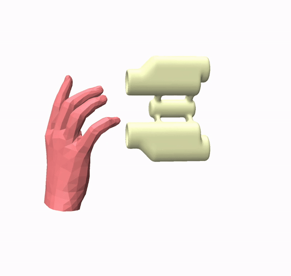 | 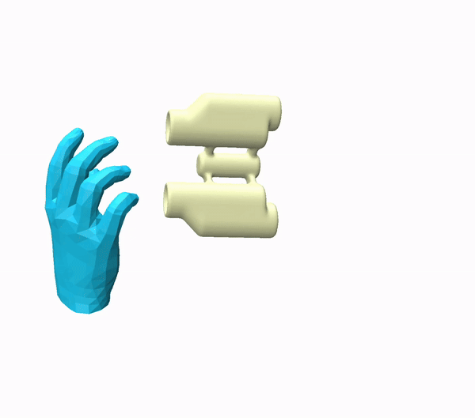 | 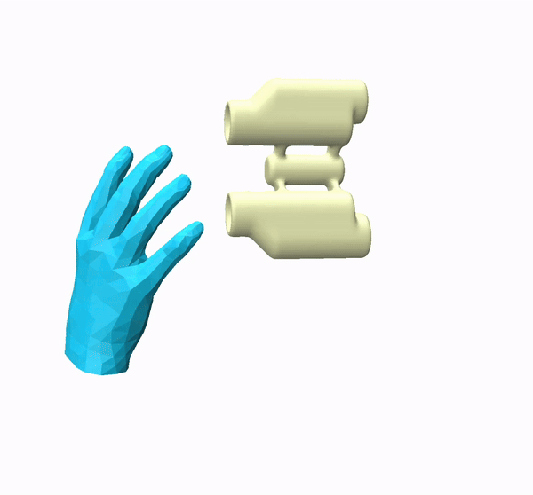 |


To reproduce the above result, follow the steps below:

1. **Denoising**
   ```bash
   bash scripts/val_examples/predict_grab_rndseed_14.sh
   #### After completing the above command ####
   bash scripts/val_examples/predict_grab_rndseed_spatial_14.sh
   ```
   Ten random seeds will be utilizd for prediction. The predicted results will be saved in the folder `./data/grab/result`. 
2. **Mesh reconstruction**
   ```bash
   bash scripts/val_examples/reconstruct_grab_14.sh
   ```
   Results will be saved under the same folder with the above step. 
3. **Extracting results and visualization** 
   ```bash
   python visualize/vis_grab_example_14.py
   ```
   Adjust camera pose in the viewer given the first frame. Then figures capturing all frames will be saved under the root folder of the project. Use your favorate tool to compose them together into a video. 

**Evaluate on the test split** 

1. **Update data and experimental paths in `.sh` scripts**
   - For GRAB testing scripts, including [`scripts/val/predict_grab_rndseed.sh`](./scripts/val/predict_grab_rndseed.sh), [`scripts/val/predict_grab_rndseed_spatial.sh`](./scripts/val/predict_grab_rndseed_spatial.sh), and [`scripts/val/reconstruct_grab.sh`](./scripts/val/reconstruct_grab.sh), please edit the data and experimental path-related arguments specified in those scripts to correspond to the paths where the downloaded data is saved. For instance, 
   ```bash
      ################# [Edit here] Set to your paths #################
      #### Data and exp folders ####
      export seq_root="data/grab/GRAB_processed/test"
      export grab_path="data/grab/GRAB_extracted"
      export save_dir="exp/grab/eval_save"
      export grab_processed_dir="data/grab/GRAB_processed"
   ```
2. **Denoising**
   ```bash
   bash scripts/val/predict_grab_rndseed.sh
   #### After completing the above command ####
   bash scripts/val/predict_grab_rndseed_spatial.sh
   ```
3. **Mesh reconstruction**
   To utilize the script [`scripts/val/reconstruct_grab.sh`](./scripts/val/reconstruct_grab.sh) to reconstruct a single sequence, you need to set the `single_seq_path` and the `test_tag` in the script before running it.
   ```bash
   bash scripts/val/reconstruct_grab.sh
   ```

**Denoising a full sequence**


The evaluation setting for GRAB denoises the first 60 frames of a sequence. To denoise a full sequence, the input can be divided into several overlapping clips, each containing 60 frames. These clips can then be cleaned independently, followed by reconstructing the mesh sequence together.

For example, taking `data/grab/source_data/14.npy`, the following scripts will add artificial Gaussian noise to it and denoise the full sequence:

```bash
##### Denoising #####
bash scripts/val/predict_grab_fullseq_rndseed.sh
##### Denoising #####
bash scripts/val/predict_grab_fullseq_rndseed_spatial.sh
##### Reconstructing #####
bash scripts/val/reconstruct_grab_fullseq.sh
```

The `single_seq_path` parameter in each script specifies the sequence to denoise. 


### GRAB (Beta)


**Example**


The input noisy trajectory is constructed by adding noise from a Beta distirbution onto the trajectory `data/grab/source_data/14.npy`. And two different denoised samples are shown as below. 


|        Input        |       Result 1         |         Result 2         |
| :----------------------: | :---------------------: | :-----------------------: |
| 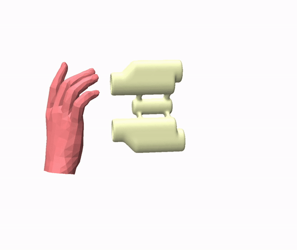 | 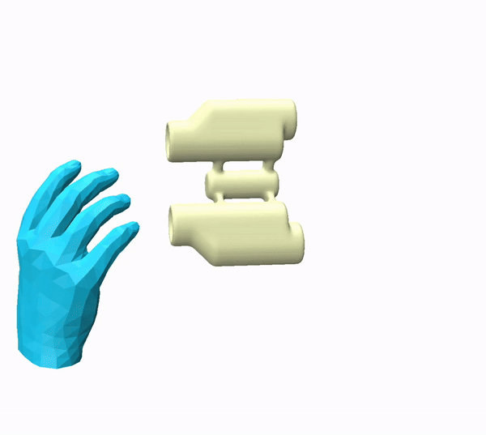 | 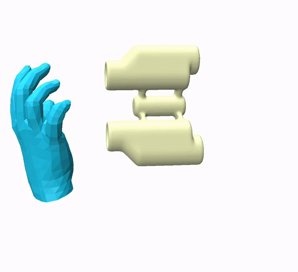 |


To reproduce this result, use the scripts located in the `scripts/val_examples` directory. Please notice that the `pert_type` argument in each `.sh` file should be set to `beta`. 


**Evaluate on the test split** 


To run th evaluation process on all GRAB test sequences, follow the same steps as outlined in the previous section. Please notice that the `pert_type` argument in each `.sh` file should be set to `beta`. 


**Denoising a full sequence**

Follow the same steps as outlined in the previous section. Don't forget to set the `pert_type` argument in each `.sh` file should be set to `beta`. 


### TACO

> Here's an example of cleaning an input noisy trajectory `data/taco/source_data/20231104_017.pkl`. 


Below are the input, result, and overlayed video.


|        Input        |       Result         |         Overlayed         |
| :----------------------: | :---------------------: | :-----------------------: |
| 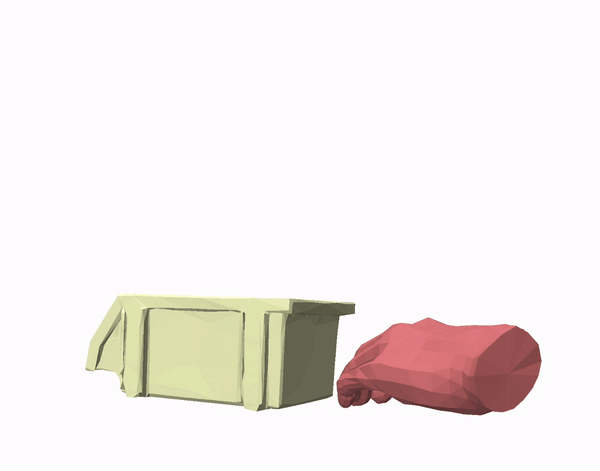 | 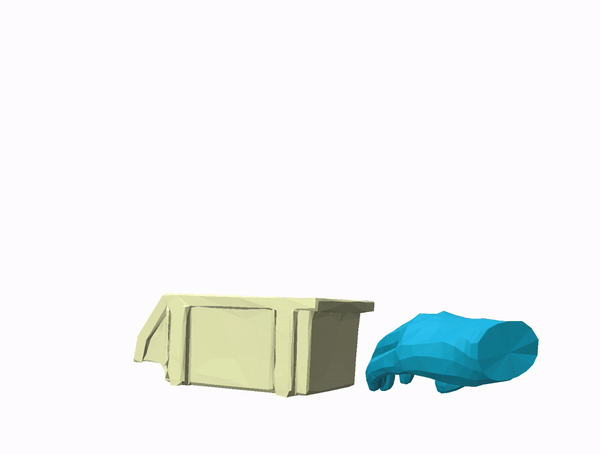 | 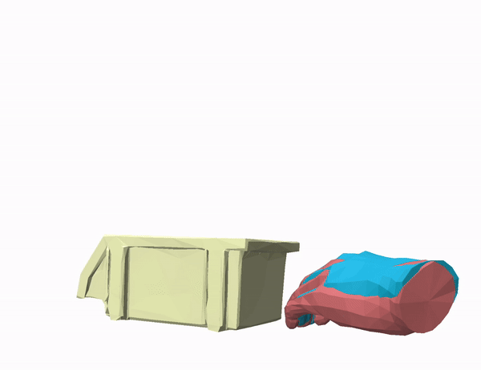 |


To reproduce the above result, follow the steps below:

1. **Denoising**
   ```bash
   bash scripts/val_examples/predict_taco_rndseed_spatial_20231104_017.sh
   ```
   Ten random seeds will be utilized for prediction, and the predicted results will be saved in the folder `./data/taco/result`.
2. **Mesh reconstruction**
   ```bash
   bash scripts/val_examples/reconstruct_taco_20231104_017.sh
   ```
   Results will be saved in the same folder as mentioned in the previous step.
3. **Extracting results and visualization** 
   ```bash
   python visualize/vis_taco_example_20231104_017.py
   ```
   Adjust the camera pose in the viewer based on the first frame. Figures of all frames will be captured and saved in the root folder of the project. Finally, use your preferred tool to compile these figures into a video.
   


### HOI4D

**Example**

> Here's an example of cleaning an input noisy trajectory `data/hoi4d/source_data/ToyCar/case3/merged_data.npy`. 


Below are the input, result, and overlayed video.


|        Input        |       Result         |         Overlayed         |
| :----------------------: | :---------------------: | :-----------------------: |
| 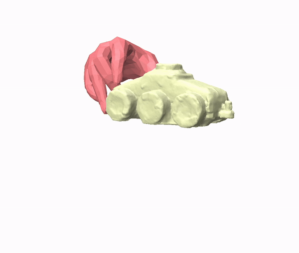 | 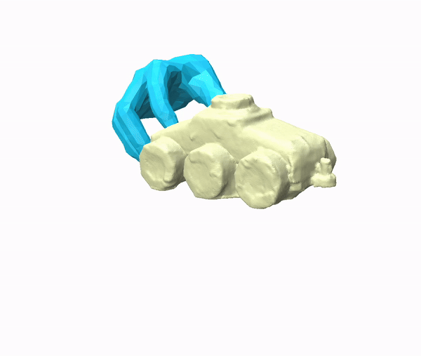 | 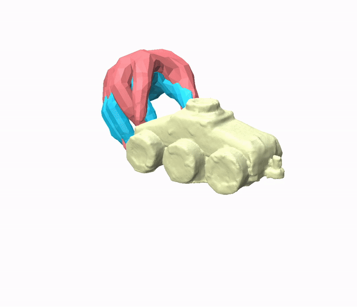 |


To reproduce the above result, follow the steps below:

1. **Denoising**
   ```bash
   bash scripts/val_examples/predict_hoi4d_rndseed_toycar_inst3.sh
   #### After completing the above command ####
   bash scripts/val_examples/predict_hoi4d_rndseed_toycar_inst3_spatial.sh
   ```
   Ten random seeds will be utilized for prediction, and the predicted results will be saved in the folder `./data/hoi4d/result/ToyCar`.
2. **Mesh reconstruction**
   ```bash
   bash scripts/val_examples/reconstruct_hoi4d_toycar_inst3.sh
   ```
   Results will be saved in the same folder as mentioned in the previous step.
3. **Extracting results and visualization** 
   ```bash
   python visualize/vis_hoi4d_example_toycar_inst3.py
   ```
   Adjust the camera pose in the viewer based on the first frame. Figures of all frames will be captured and saved in the root folder of the project. Finally, use your preferred tool to compile these figures into a video.

**Per-Category Evaluation (on rigid categories)**


1. **Update data and experimental paths in `.sh` scripts**
   
   For evaluating on all sequences of a category `CAT_NM`, modify the followig parameter settings in file `scripts/val/predict_hoi4d_rndseed.sh`, `scripts/val/predict_hoi4d_rndseed_spatial.sh`, and `scripts/val/reconstruct_hoi4d_category.sh` by setting `hoi4d_cad_model_root` to the path to where you have downloaded the `HOI4D_CAD_Model_for_release` (e.g. `data/hoi4d/HOI4D_CAD_Model_for_release`), `hoi4d_data_root` to the path where you have downloaded `HOI_Processed_Data_Rigid` (for a rigid category) or `HOI_Processed_Data_Arti` (for an articulated category), `hoi4d_category_name` to `CAT_NM`, `hoi4d_eval_st_idx` to the minimum sequence index, and `hoi4d_eval_ed_idx` to the maximum sequence index. 
   ```bash
   export hoi4d_cad_model_root="data/hoi4d/HOI4D_CAD_Model_for_release"
   export hoi4d_data_root="data/hoi4d/HOI_Processed_Data_Rigid"
   export hoi4d_category_name="ToyCar"
   export hoi4d_eval_st_idx=0
   export hoi4d_eval_ed_idx=250
   ```

   Additionally, specify you experiment folders in the above mentioned `.sh` files accordingly by modifying the following argument(s). 
   ```bash
   export save_dir="data/hoi4d/result"
   ```
2. **Denoising**
   ```bash
   bash scripts/val/predict_hoi4d_rndseed.sh
   #### After completing the above command ####
   bash scripts/val/predict_hoi4d_rndseed_spatial.sh

3. **Mesh reconstruction**
   ```bash
   bash scripts/val/reconstruct_hoi4d_category.sh
   ```

**Per-Category Evaluation (on articulated categories)**

Follow the above insructions but use the following three scripts for articulated categories instead: `scripts/val/predict_hoi4d_arti_rndseed.sh`, `scripts/val/predict_hoi4d_arti_rndseed_spatial.sh`, and `scripts/val/reconstruct_hoi4d_arti_category.sh`. 
In each of them, set the argument `hoi4d_data_root` to the root folder where you store the pre-processed articulated data (e.g. `data/hoi4d/HOI_Processed_Data_Arti`). You can vary the value of the argument `select_part_idx` to select which part to use as the base part for providing object points. 

After setting necessary arguments, run the denoising step and mesh reconstruction step as follows: 
1. **Denoising**
   ```bash
   bash scripts/val/predict_hoi4d_arti_rndseed.sh
   #### After completing the above command ####
   bash scripts/val/predict_hoi4d_arti_rndseed_spatial.sh

2. **Mesh reconstruction**
   ```bash
   bash scripts/val/reconstruct_hoi4d_arti_category.sh
   ```

Results will be saved in the folder `${save_dir}/${hoi4d_category_name}`. 

## TODOs

- [x] Example usage, evaluation process and pre-trained models
- [x] HOI4D example usage
- [x] Evaluation process on HOI4D (Rigid, Articulated)
- [x] Data: HOI4D (Rigid, Articulated)
- [ ] Training procedure
- [ ] Evaluation process on ARCTIC
- [ ] Data: ARCTIC, and more examples on TACO

  

## Contact

Please contact xymeow7@gmail.com or create a github issue if you have any questions.


## Bibtex
If you find this code useful in your research, please cite:

```bibtex
@inproceedings{liu2024geneoh,
   title={GeneOH Diffusion: Towards Generalizable Hand-Object Interaction Denoising via Denoising Diffusion},
   author={Liu, Xueyi and Yi, Li},
   booktitle={The Twelfth International Conference on Learning Representations},
   year={2024}
}
```


## Acknowledgments

This code is standing on the shoulders of giants. We want to thank the following contributors
that our code is based on: [motion-diffusion-model](https://github.com/GuyTevet/motion-diffusion-model) and [guided-diffusion](https://github.com/openai/guided-diffusion).

## License
This code is distributed under an [MIT LICENSE](LICENSE).

