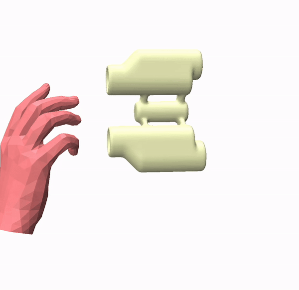

# Generalizable HOI Denoising


### [Project](https://meowuu7.github.io/GeneOH-Diffusion/) | [Gradio Demo](https://huggingface.co/spaces/xymeow7/gene-hoi-denoising) | [OpenReview](https://openreview.net/forum?id=FvK2noilxT)

The PyTorch implementation of the paper [**"GeneOH Diffusion"**](https://arxiv.org/abs/2209.14916).


## Getting started

This code was tested on `Ubuntu 20.04.5 LTS` and requires:

* Python 3.8.13
* conda3 or miniconda3
* CUDA capable GPU (one is enough)

### 1. Setup environment

Create a virtual environment

```shell
conda create -n geneoh-diffusion python==3.8.13
```

Install `torch2.2.0+cu121`
```shell
pip3 install torch torchvision torchaudio
```

Install `torch_cluster`
```shell
cd whls
pip install torch_cluster-1.6.3+pt22cu121-cp38-cp38-linux_x86_64.whl
cd ..
```

Install remaining dependencies

```shell
pip install -r requirements.txt --no-cache
```

**Important**: Install `manopth`

```shell
cd manopth
pip install -e .
cd ..
```

**Note that the MANO layer we use is slightly different from the original official release. The `manopth` package should be install from this project otherwise the model would produce wierd denoised results**

### 2. Download pre-trained models

Download models from [here](https://drive.google.com/drive/folders/1_0p2REWdisKx2sCAvHkOHsNFjZUwi87h?usp=sharing) and put them under the folder `./ckpts`. 

### 3. Get data 

**1. GRAB**

- Download [preprocessed data (object, test split)](https://1drv.ms/u/s!AgSPtac7QUbHgS4lAVZmVnhp4c-2?e=njx6oZ). Extract them under a data folder for GRAB preprocessed object data (*e.g.* `./data/grab/GRAB_processed`). 
- Download [GRAB object meshes](https://drive.google.com/file/d/19uvDxyHR9-kFi6wsU-7XFI5HoJu7MaZE/view?usp=sharing) and unzip the obtained `object_meshes.zip` under the folder `./data/grab`.
- Download [preprocessed data (hand, test split)](https://1drv.ms/u/s!AgSPtac7QUbHgTCIWuIDnf3J9BuK?e=1HsJXu). Extract them under a data folder for GRAB preprocessed subject data (*e.g.* `./data/grab/GRAB_processed_wsubj`). 

**2. TACO**
We include data samples from a recent [TACO dataset](https://taco2024.github.io/) in the folder `./data/taco/source_data` for test. More data is coming. 


## Usage

### GRAB


**Example**

> An example of cleaning an input trajectory (sequence 14 of GRAB's test split) with Gaussian noise.

Use the model to clean the noisy trajectory `data/grab/source_data/14.npy`. The input sequence and two different samples are shown as below. 


|        Input        |       Result 1         |         Result 2         |
| :----------------------: | :---------------------: | :-----------------------: |
|  |  |  |


Follow steps below to reproduce the above result. 

1. **Denoising**
   ```bash
   bash scripts/val_examples/predict_grab_rndseed_14.sh
   #### After completing the above command ####
   bash scripts/val_examples/predict_grab_rndseed_spatial_14.sh
   ```
   Ten random seeds will be utilizd for prediction. The predicted results will be saved in the folder `./data/grab/result`. 
2. **Mesh reconstruction**
   ```bash
   bash scripts/val_examples/reconstruct_grab_14.sh
   ```
   Results will be saved under the same folder with the above step. 
3. **Extracting results and visualization** 
   ```bash
   python visualize/vis_grab_example_14.py
   ```
   Adjust camera pose in the viewer given the first frame. Then figures capturing all frames will be saved under the root folder of the project. Use your favorate tool to compose them together into a video. 

**Evaluate on the test split** 

1. **Update data and experimental paths in `.sh` scripts**
   - For GRAB testing scripts, including [`scripts/val/predict_grab_rndseed.sh`](./scripts/val/predict_grab_rndseed.sh), xxx, xxx, edit data and experimental path related arguments specified in those scripts to your corresponding paths where donwloaded data are saved. For instance, 
   ```bash
      ################# [Edit here] Set to your paths #################
      #### Data and exp folders ####
      export seq_root="data/grab/GRAB_processed/test"
      export grab_path="data/grab/GRAB_extracted"
      export save_dir="exp/grab/eval_save"
      export grab_processed_dir="data/grab/GRAB_processed"
   ```
2. **Denoising**
   ```bash
   bash scripts/val/predict_grab_rndseed.sh
   #### After completing the above command ####
   bash scripts/val/predict_grab_rndseed_spatial.sh
   ```
3. **Mesh reconstruction**
   Script [`scripts/val/reconstruct_grab.sh`](./scripts/val/reconstruct_grab.sh) can reconstruct a single sequence, which is what the argument `single_seq_path` points to. Set the `single_seq_path` and the test tag in the script and run it:
   ```bash
   bash scripts/val/reconstruct_grab.sh
   ```

**Denoising a full sequence**


full evals
- preprocessed data 
- reconstruction pipelines
- full sequence processing file
- full sequence processing pipeline


### GRAB (Beta)


**Example**

> An example of cleaning an input trajectory (sequence 14 of GRAB's test split) with noise sampled from a Beta distribution.

Use the model to clean the noisy trajectory `data/grab/source_data/14.npy`. The input sequence and two different samples are shown as below. 


|        Input        |       Result 1         |         Result 2         |
| :----------------------: | :---------------------: | :-----------------------: |
|  |  |  |


Use scripts in `scripts/val_examples` for the GRAB example outlined in the previous section but changing the `pert_type` argument in each `.sh` file from `gaussian` to `beta` to reproduce the results. 


**Evaluate on the test split** 


To run th evaluation process on all GRAB test sequences, follow the same steps as outlined in the previous section but change the `pert_type` argument in each `.sh` file from `gaussian` to `beta`. 


### TACO

Use the model to clean the noisy trajectory `data/taco/source_data/20231104_017.pkl`. Input, result, and the overlayed video are shown as below.


|        Input        |       Result         |         Overlayed         |
| :----------------------: | :---------------------: | :-----------------------: |
|  |  |  |


Follow steps below to reproduce the above result. 

1. **Denoising**
   ```bash
   bash scripts/val_examples/predict_taco_rndseed_spatial_20231104_017.sh
   ```
   Ten random seeds will be utilizd for prediction. The predicted results will be saved in the folder `./data/taco/result`. 
2. **Mesh reconstruction**
   ```bash
   bash scripts/val_examples/reconstruct_taco_20231104_017.sh
   ```
   Results will be saved under the same folder with the above step. 
3. **Extracting results and visualization** 
   ```bash
   python visualize/vis_taco_example_20231104_017.py
   ```
   Adjust camera pose in the viewer given the first frame. Then figures capturing all frames will be saved under the root folder of the project. Use your favorate tool to compose them together into a video. 
   


## TODOs

- [ ] HOI4D, TACO
- [ ] Training pipelines


## Bibtex
If you find this code useful in your research, please cite:

```bibtex
@article{tevet2022human,
  title={Human Motion Diffusion Model},
  author={Tevet, Guy and Raab, Sigal and Gordon, Brian and Shafir, Yonatan and Bermano, Amit H and Cohen-Or, Daniel},
  journal={arXiv preprint arXiv:2209.14916},
  year={2022}
}
```


## Acknowledgments

This code is standing on the shoulders of giants. We want to thank the following contributors
that our code is based on: [motion-diffusion-model](https://github.com/GuyTevet/motion-diffusion-model) and [guided-diffusion](https://github.com/openai/guided-diffusion).

## License
This code is distributed under an [MIT LICENSE](LICENSE).

